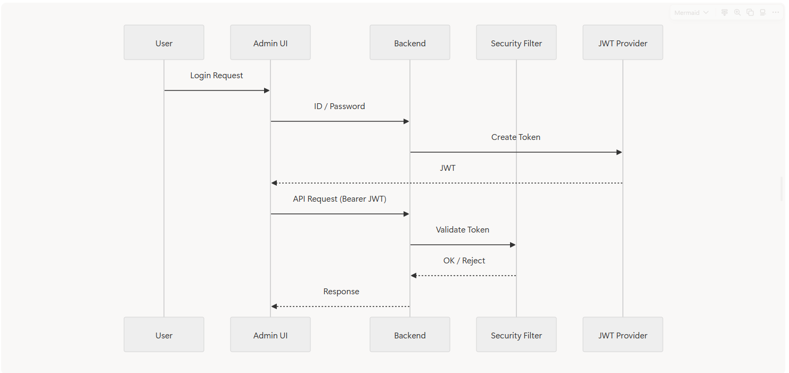
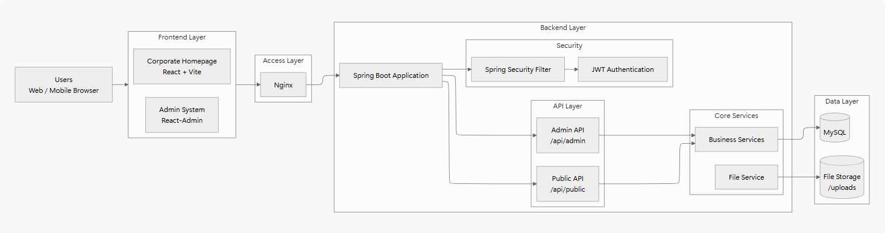
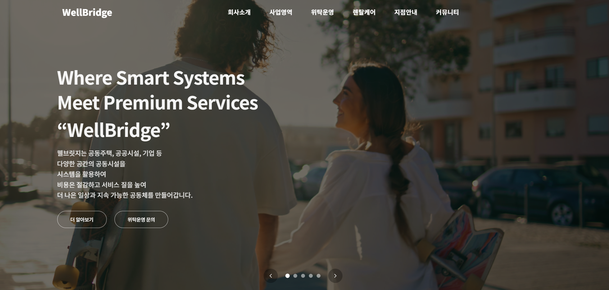
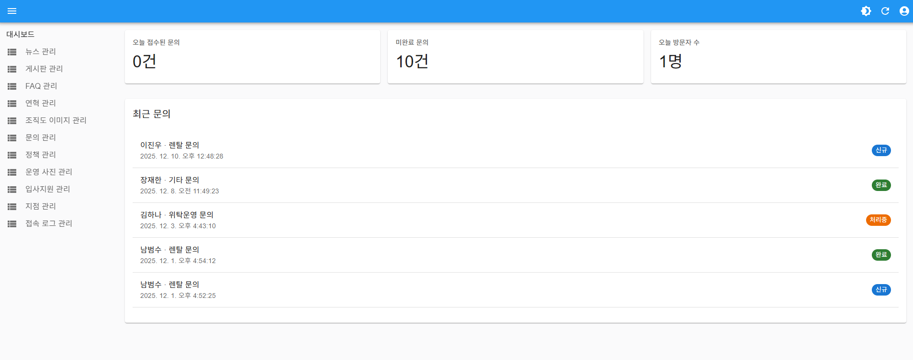
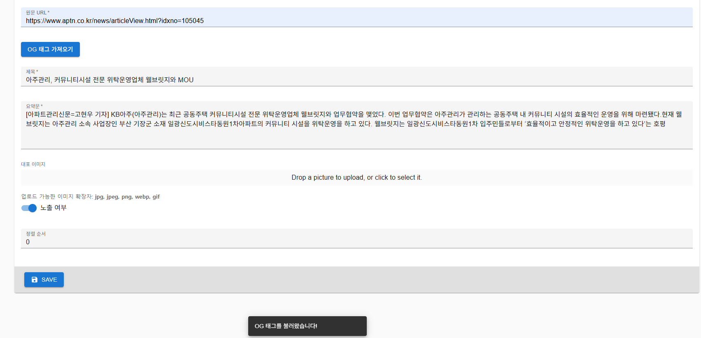

# 🏢 WellBridge 기업 홈페이지 & 관리자 시스템 (CMS)

**React (Vite) · Spring Boot · React-Admin · JWT · MySQL**

실무 환경에서 **기업 홈페이지 + 관리자(CMS)** 를 단독으로 설계·구현하고  
내부 운영 환경에 배포까지 수행한 프로젝트입니다.  
회사 정책상 소스코드는 비공개이며, 본 문서는 **구조·기능·기술적 의사결정 중심의 케이스 스터디**입니다.

---

## 1. 프로젝트 개요

- **프로젝트명**: WellBridge 기업 홈페이지 및 관리자 시스템
- **개발 기간**: 2024.10 ~ 2024.12
- **수행 방식**: **단독 개발**
- **배포 현황**: 내부 운영 환경 배포 (실사용)
- **코드 공개 여부**: 비공개 (사내 자산)
- **핵심 키워드**: CMS 구축, REST API 설계, JWT 인증/인가, 파일 업로드, 운영 중심 설계

---

## 2. 담당 역할 (기여도 100%)

### 👨‍💻 담당 범위

- React + Vite 기반 **기업 홈페이지 프론트엔드 전체 구현**
- Tailwind CSS 기반 **반응형 UI 설계**
- React-Admin 기반 **관리자 시스템(CMS) 구축**
- Spring Boot 기반 REST API 설계 및 연동
- JWT 기반 관리자 로그인/인증/인가 처리
- 이미지 업로드 및 파일 서빙 구조 설계
- Nginx 기반 프론트·백엔드 연동 및 운영 환경 구성

---

## 3. 기술 스택

| 구분 | 사용 기술 |
|---|---|
| Frontend | React (Vite), Tailwind CSS |
| Admin UI | React-Admin |
| Backend | Spring Boot, JPA |
| Database | MySQL |
| Auth | JWT |
| File | Multipart Upload, 서버 파일 저장 |
| Infra | Nginx |

---

## 4. 시스템 아키텍처 및 설계 개요

### 📌 System Overview

- 사용자용 기업 홈페이지와 관리자 시스템 분리
- 정적 리소스 + REST API 기반 통신
- 운영 환경을 고려한 계층 분리 구조

---

### 📐 Detailed Architecture

- **Frontend**
  - Corporate Homepage (React + Vite)
  - Admin System (React-Admin)
- **Access Layer**
  - Nginx (정적 파일 서빙 + API Reverse Proxy)
- **Backend**
  - Spring Boot Application
  - JWT 기반 Security Filter
  - Admin API (`/api/admin`)
  - Public API (`/api/public`)
- **Data Layer**
  - MySQL
  - File Storage (`/uploads`)

---

## 5. 주요 기능

| 기능 | 설명 |
|---|---|
| 🏠 기업 홈페이지 | 메인, 회사소개, 사업영역, 조직도, 지점안내 |
| 📰 뉴스/게시판 | 공지·뉴스 목록 및 상세 페이지 |
| 🖼 이미지 관리 | 뉴스·게시글·운영사진 업로드 및 조회 |
| 📩 문의 관리 | 사용자 문의 등록 / 관리자 조회 |
| 🔐 관리자 로그인 | JWT 기반 인증 및 접근 제어 |
| 🧩 CMS | React-Admin 기반 CRUD |
| 📱 반응형 UI | PC / Tablet / Mobile 대응 |

---

## 6. 기술적 문제 해결 사례

### ① 이미지 업로드 구조 복잡화 문제

- 리소스별로 이미지 처리 방식이 달라 유지보수 어려움 발생

**해결**
- 업로드/서빙 로직 공통화
- 이미지 URL 규칙 통일
- React-Admin dataProvider에서 이미지 처리 분리

---

### ② 관리자 인증 및 접근 제어

- 관리자 전용 기능에 대한 보안 요구

**해결**
- JWT 기반 로그인 구현
- `/api/admin` 경로 인증 필수화
- 비인가 접근 차단 처리

---

### ③ 뉴스 등록 시 저작권 및 입력 번거로움

- 외부 기사 수기 입력 → 누락 및 저작권 리스크

**해결**
- 외부 URL 입력 시 **OG(Open Graph) 태그 자동 수집**
- 제목·요약·대표 이미지 자동 입력
- 원문 링크 저장 강제 → 출처 명시 구조 확보

---

## 7. 구현 화면

### 🏠 기업 홈페이지 메인

---

### 🔐 관리자 대시보드

---

### 📰 뉴스 등록 (OG 태그 자동 수집)

---

## 8. 결과 및 회고

### 📈 결과
- 기업 홈페이지 + 관리자 시스템 **실운영 가능 수준으로 구축**
- 콘텐츠 관리 효율 및 운영 안정성 향상
- 프론트엔드–백엔드–관리자 시스템 전반을 아우르는 실무 경험 확보

### 🤔 회고
- 단순 UI 구현을 넘어 **서비스 구조와 운영 흐름을 이해하는 개발**의 중요성을 체감
- 다음 단계에서는 API 문서화, 관리자 권한 세분화, 운영 모니터링을 고도화하고 싶다고 느꼈음

---
